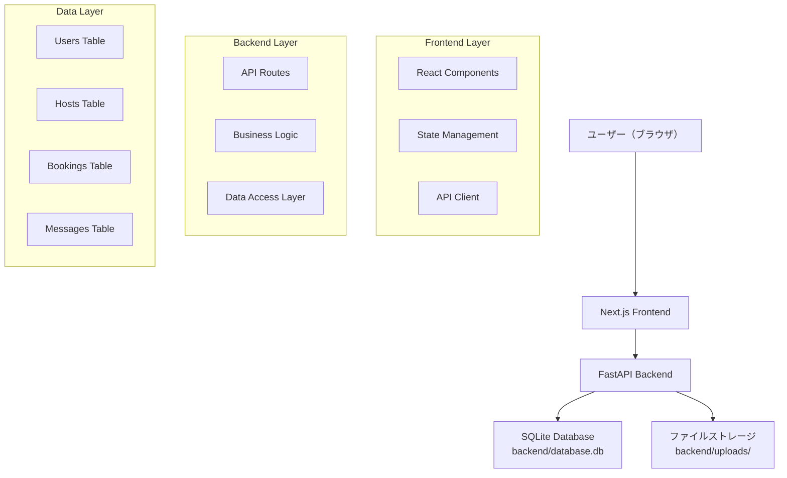

# 設計書

## 概要

StayConnectは、趣味や興味関心に基づいて宿主とゲストをマッチングするモバイルファーストの宿泊マッチングアプリです。Next.js（TypeScript）でフロントエンド、FastAPI（Python）でバックエンドを構築し、レスポンシブなWebアプリケーションとして実装します。

## アーキテクチャ

### システム構成



### 技術スタック

**フロントエンド:**
- Next.js 14 (App Router)
- TypeScript
- Tailwind CSS
- React Hook Form
- SWR (データフェッチング)

**バックエンド:**
- FastAPI
- SQLAlchemy (ORM)
- SQLite (開発用データベース、本番環境ではPostgreSQL推奨)
- Pydantic (データ検証)
- JWT認証

**データストレージ:**
- メインデータベース：SQLite (`backend/database.db`)
- 画像ファイル：`backend/uploads/` ディレクトリ
- ログファイル：`backend/logs/` ディレクトリ

## コンポーネントとインターフェース

### フロントエンドコンポーネント構造

```
src/
├── app/
│   ├── layout.tsx                 # ルートレイアウト
│   ├── page.tsx                   # ホーム/サインアップページ
│   ├── login/
│   │   └── page.tsx              # ログインページ
│   ├── search/
│   │   └── page.tsx              # 宿主検索ページ
│   ├── host/
│   │   └── [id]/
│   │       └── page.tsx          # 宿主詳細ページ
│   ├── mypage/
│   │   └── page.tsx              # マイページ
│   └── booking/
│       └── [id]/
│           └── page.tsx          # 予約ページ
├── components/
│   ├── ui/                       # 共通UIコンポーネント
│   │   ├── Button.tsx
│   │   ├── Input.tsx
│   │   ├── Modal.tsx
│   │   └── Card.tsx
│   ├── layout/                   # レイアウトコンポーネント
│   │   ├── Header.tsx
│   │   ├── Navigation.tsx
│   │   └── MobileNav.tsx
│   ├── auth/                     # 認証関連
│   │   ├── SignupForm.tsx
│   │   └── LoginForm.tsx
│   ├── search/                   # 検索関連
│   │   ├── HostCard.tsx
│   │   ├── FilterBar.tsx
│   │   └── HostList.tsx
│   ├── host/                     # 宿主詳細関連
│   │   ├── HostProfile.tsx
│   │   ├── PhotoGallery.tsx
│   │   ├── ReviewList.tsx
│   │   └── AvailabilityCalendar.tsx
│   └── profile/                  # プロフィール関連
│       ├── ProfileCard.tsx
│       ├── InterestTags.tsx
│       └── EditProfileForm.tsx
├── lib/
│   ├── api.ts                    # API クライアント
│   ├── auth.ts                   # 認証ユーティリティ
│   └── utils.ts                  # 共通ユーティリティ
└── types/
    ├── user.ts                   # ユーザー型定義
    ├── host.ts                   # 宿主型定義
    └── booking.ts                # 予約型定義
```

### バックエンドAPI構造

```
backend/
├── main.py                       # FastAPIアプリケーション
├── models/
│   ├── __init__.py
│   ├── user.py                   # ユーザーモデル
│   ├── host.py                   # 宿主モデル
│   ├── booking.py                # 予約モデル
│   └── message.py                # メッセージモデル
├── schemas/
│   ├── __init__.py
│   ├── user.py                   # ユーザースキーマ
│   ├── host.py                   # 宿主スキーマ
│   ├── booking.py                # 予約スキーマ
│   └── auth.py                   # 認証スキーマ
├── routers/
│   ├── __init__.py
│   ├── auth.py                   # 認証API
│   ├── users.py                  # ユーザーAPI
│   ├── hosts.py                  # 宿主API
│   ├── bookings.py               # 予約API
│   └── messages.py               # メッセージAPI
├── services/
│   ├── __init__.py
│   ├── auth_service.py           # 認証サービス
│   ├── matching_service.py       # マッチングサービス
│   └── notification_service.py   # 通知サービス
├── database/
│   ├── __init__.py
│   ├── connection.py             # データベース接続
│   └── migrations/               # マイグレーション
└── utils/
    ├── __init__.py
    ├── security.py               # セキュリティユーティリティ
    └── helpers.py                # ヘルパー関数
```

## データモデル

### ユーザーモデル

```python
class User(BaseModel):
    id: int
    name: str
    email: str
    password_hash: str
    interests: List[str]  # 興味関心のリスト
    location: Optional[str]
    bio: Optional[str]
    profile_image: Optional[str]
    rating: float = 0.0
    review_count: int = 0
    created_at: datetime
    updated_at: datetime
```

### 宿主モデル

```python
class Host(BaseModel):
    id: int
    user_id: int  # ユーザーテーブルへの外部キー
    title: str
    description: str
    location: str
    property_type: str  # "apartment", "house", etc.
    max_guests: int
    amenities: List[str]
    house_rules: List[str]
    photos: List[str]  # 写真URLのリスト
    price_per_night: float
    available_dates: List[dict]  # 利用可能日程
    is_active: bool = True
    created_at: datetime
    updated_at: datetime
```

### 予約モデル

```python
class Booking(BaseModel):
    id: int
    guest_id: int  # ゲストのユーザーID
    host_id: int   # 宿主ID
    check_in: date
    check_out: date
    guests_count: int
    total_price: float
    status: str  # "pending", "confirmed", "cancelled", "completed"
    message: Optional[str]  # 予約時のメッセージ
    created_at: datetime
    updated_at: datetime
```

### メッセージモデル

```python
class Message(BaseModel):
    id: int
    booking_id: int
    sender_id: int
    receiver_id: int
    content: str
    is_read: bool = False
    created_at: datetime
```

## API エンドポイント設計

### 認証API

```
POST /api/auth/signup          # ユーザー登録
POST /api/auth/login           # ログイン
POST /api/auth/logout          # ログアウト
POST /api/auth/refresh         # トークンリフレッシュ
```

### ユーザーAPI

```
GET  /api/users/me             # 現在のユーザー情報取得
PUT  /api/users/me             # ユーザー情報更新
GET  /api/users/{id}           # 特定ユーザー情報取得
POST /api/users/upload-avatar  # プロフィール画像アップロード
```

### 宿主API

```
GET  /api/hosts                # 宿主一覧取得（検索・フィルタリング）
GET  /api/hosts/{id}           # 宿主詳細取得
POST /api/hosts                # 宿主情報登録
PUT  /api/hosts/{id}           # 宿主情報更新
GET  /api/hosts/{id}/reviews   # 宿主のレビュー取得
GET  /api/hosts/matching/{user_id}  # マッチング率計算
```

### 予約API

```
GET  /api/bookings             # 予約一覧取得
POST /api/bookings             # 予約申し込み
GET  /api/bookings/{id}        # 予約詳細取得
PUT  /api/bookings/{id}        # 予約ステータス更新
DELETE /api/bookings/{id}      # 予約キャンセル
```

### メッセージAPI

```
GET  /api/messages/conversations  # 会話一覧取得
GET  /api/messages/{booking_id}   # 特定予約のメッセージ取得
POST /api/messages                # メッセージ送信
PUT  /api/messages/{id}/read      # メッセージ既読更新
```

## マッチングアルゴリズム

### マッチング率計算ロジック

```python
def calculate_match_rate(guest_interests: List[str], 
                        host_interests: List[str],
                        location_preference: str,
                        host_location: str,
                        host_rating: float) -> float:
    
    # 興味関心の一致率 (60%の重み)
    common_interests = set(guest_interests) & set(host_interests)
    interest_score = len(common_interests) / max(len(guest_interests), 1) * 0.6
    
    # 立地の一致 (25%の重み)
    location_score = 0.25 if location_preference in host_location else 0
    
    # 宿主の評価 (15%の重み)
    rating_score = (host_rating / 5.0) * 0.15
    
    return min((interest_score + location_score + rating_score) * 100, 100)
```

## エラーハンドリング

### フロントエンドエラーハンドリング

- APIエラーレスポンスの統一的な処理
- ネットワークエラーの適切な表示
- フォームバリデーションエラーの表示
- 404ページやエラーページの実装

### バックエンドエラーハンドリング

```python
class APIException(Exception):
    def __init__(self, status_code: int, detail: str):
        self.status_code = status_code
        self.detail = detail

# カスタム例外ハンドラー
@app.exception_handler(APIException)
async def api_exception_handler(request: Request, exc: APIException):
    return JSONResponse(
        status_code=exc.status_code,
        content={"detail": exc.detail}
    )
```

## テスト戦略

### フロントエンドテスト

- Jest + React Testing Library でコンポーネントテスト
- Cypress でE2Eテスト
- ユーザーフローの主要パスをカバー

### バックエンドテスト

- pytest でAPIエンドポイントテスト
- テストデータベースを使用した統合テスト
- マッチングアルゴリズムの単体テスト

## セキュリティ考慮事項

### 認証・認可

- JWT トークンベース認証
  - アクセストークン：短期間（15分）、メモリまたはhttpOnlyクッキーに保存
  - リフレッシュトークン：長期間（7日）、httpOnlyクッキーに保存
- パスワードのハッシュ化（bcrypt）
- CORS設定の適切な管理

### ログイン状態の管理

**フロントエンド:**
- Next.js のサーバーサイドでhttpOnlyクッキーからトークンを読み取り
- クライアントサイドではContext APIでログイン状態を管理
- 自動ログアウト機能（トークン期限切れ時）

**バックエンド:**
- JWTトークンの発行・検証
- リフレッシュトークンによる自動更新機能
- セッション管理（オプション：Redisキャッシュ）

### データ保護

- 個人情報の適切な暗号化
- SQLインジェクション対策
- XSS攻撃対策

### プライバシー

- ユーザーの位置情報の適切な管理
- メッセージの暗号化
- データ削除機能の実装