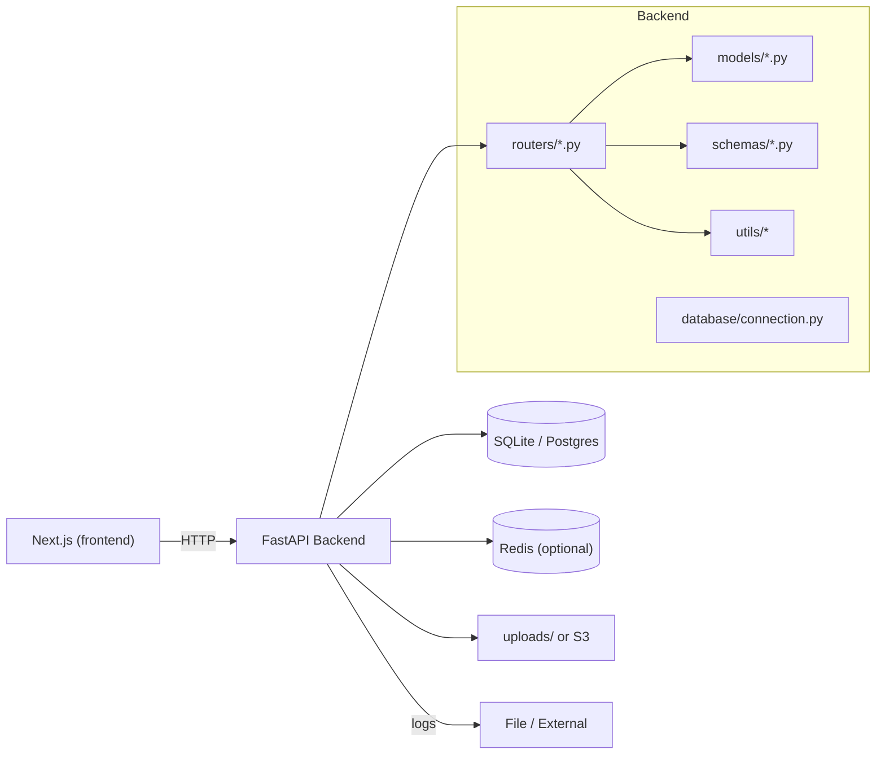
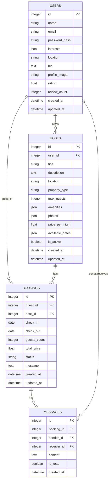

# StayConnect — 技術ドキュメント（開発者向け）

対象読者: 新人〜中級エンジニア
想定利用場面: 開発・ローカル検証・CI

---

## 1. 概要

StayConnect は宿泊マッチング系のサンプルサービスです。主なバックエンド機能は以下。

- ユーザー登録・認証（JWT）
- ホスト（宿泊提供）の登録・検索・管理
- 予約（Booking）作成・更新・キャンセル
- メッセージ（Booking に紐づくチャット）
- ヘルスチェック・準備確認エンドポイント

主要技術スタック:
- Python 3.11+, FastAPI, Uvicorn
- SQLAlchemy（DB 層）、SQLite（開発）/Postgres（本番推奨）
- JWT（python-jose）、passlib（bcrypt）
- Redis（任意、キャッシュ等）

必須依存は `backend/requirements.txt` を参照。

---

## 2. アーキテクチャ図

Mermaid を使った簡易図（VSCode の Markdown Preview や mermaid 対応ツールで表示可能）:



もし Markdown ビューアが Mermaid をサポートしていない場合の代替（必ず表示されます）:

```
+----------------+        HTTP        +----------------+
|  Frontend (JS) | ------------------> | FastAPI Backend|
+----------------+                     +----------------+
                                           |   |   |
                 +----------------+        |   |   +----------------+
                 |  uploads/ or S3| <------'   |                Logging
                 +----------------+            |                +-----+
                                              DB               Redis (opt)
                                         (SQLite/Postgres)
```

表示方法 / 補助:
- VSCode で Mermaid を表示するには "Markdown Preview Mermaid Support" 等の拡張を入れてください。
- もしくは https://mermaid.live に上記の Mermaid ブロックを貼り付けて確認できます。

---

## 3. API仕様（主要エンドポイント）

ベース URL: http://localhost:8000

注意: コード上はルーターの prefix が混在している箇所があります（例: `/api/hosts` と `/users`）。実際のパスはソース参照を優先してください。

認証（重要）:
- アクセストークン: Bearer <token> を Authorization ヘッダに設定
- リフレッシュトークン: httpOnly cookie（/auth/login で設定）

主要エンドポイント例:

- POST /api/auth/register
  - リクエスト: JSON { name, email, password, interests? }
  - レスポンス: { access_token, refresh_token, user }

- POST /api/auth/login
  - リクエスト: { email, password }
  - セット: httpOnly cookie に refresh_token
  - レスポンス: { access_token, refresh_token, token_type, user }

- GET /users/me
  - ヘッダ: Authorization
  - レスポンス: UserResponse

- POST /api/hosts
  - ヘッダ: Authorization
  - リクエスト: HostCreate
  - レスポンス: HostResponse

- GET /api/hosts?location=&max_guests=&skip=&limit=
  - レスポンス: HostResponse[]（検索・フィルタ）

- POST /api/bookings
  - ヘッダ: Authorization
  - リクエスト: BookingCreate (host_id, check_in, check_out, guests_count, message)
  - レスポンス: BookingResponse

- GET /health, /ready, /live
  - ヘルスチェック用（DB/Redis/disk/memory）

詳細なスキーマは `backend/schemas/*.py` を参照してください。

---

## 4. データベース設計

ER 図（Mermaid）:



注意点:
- SQLAlchemy の JSON 型は DB によって格納方法が違う（SQLite はテキスト）。Postgres へ移行する場合は JSONB での利点あり。
- created_at / updated_at は func.now() で自動設定。

---

## 5. セットアップ手順

ローカル開発（macOS / zsh）:

```bash
# backend 側
cd backend
python3 -m venv .venv
source .venv/bin/activate
pip install -r requirements.txt

# 環境変数（例）
export DATABASE_URL="sqlite:///./database.db"
export SECRET_KEY="your-strong-secret"
export REDIS_URL="redis://localhost:6379"

# DB テーブル作成
python -c "from database.init_db import create_tables; create_tables()"

# サーバ起動
uvicorn main:app --reload --host 0.0.0.0 --port 8000
```

Docker での起動:
- プロジェクトルートに docker-compose.yml があるので、必要な場合はそれを用いて起動します（環境変数を .env で渡す）。

テスト実行:

```bash
cd backend
python -m pytest tests/ -v --cov=. --cov-report=term-missing --cov-report=html
```

---

## 6. 使用例（実行可能コード）

1) ユーザー登録（curl）

```bash
curl -X POST http://localhost:8000/api/auth/register \
  -H "Content-Type: application/json" \
  -d '{"name":"Taro","email":"taro@example.com","password":"pass1234"}'
```

2) ログインと保護 API 呼び出し（Python）

```python
import requests
BASE='http://localhost:8000'
# login
r=requests.post(f"{BASE}/api/auth/login", json={"email":"taro@example.com","password":"pass1234"})
r.raise_for_status()
data=r.json()
access=data['access_token']
# call protected
resp=requests.get(f"{BASE}/users/me", headers={"Authorization":f"Bearer {access}"})
print(resp.json())
```

3) Avatar アップロード（curl）

```bash
curl -X POST http://localhost:8000/users/upload-avatar \
  -H "Authorization: Bearer <ACCESS_TOKEN>" \
  -F "file=@/path/to/avatar.jpg"
```

4) CI 用テストコマンド（例）

```bash
cd backend
pytest tests/ --cov=. --cov-report=xml
```

---

## 7. 注意事項・制限事項

- SECRET_KEY がソース内でハードコードされている場合は重大なセキュリティリスク。必ず環境変数に置き換える。
- JWT の `sub` の中身に一貫性がない（実装により email を sub にする箇所、user_id を期待する箇所がある）。create/verify の扱いを user_id に統一することを推奨。
- `get_current_user` の実装（認可ミドルウェア）はルーター間で分散している。共通の依存関数へ統合すると保守性が向上する。
- SQLite は開発向け。複数プロセス/コンテナ環境では Postgres を推奨。
- ファイルはローカル `uploads/` に保存。S3 等に切り替える場合は保存ロジックを抽象化すること。

---

## 8. トラブルシューティング

よくある問題と対処:

- サーバ起動時に import エラー:
  - `from database import get_db` のような import パスが間違っている場合がある。正しくは `from database.connection import get_db` などソースに合わせる。

- 認証で Unauthorized が返る:
  - access_token の sub 値（email vs id）を照合。`verify_token` が user_id を返すように統一するか、token 発行側を email に合わせる。

- SQLite の `database.db` がロックされる:
  - 開発用の DB ロック。高負荷 / 並列テストではメモリ DB（sqlite:///:memory:）や Postgres を利用する。

- uploads フォルダのパーミッション:
  - `mkdir -p uploads && chmod 755 uploads` を実行

- Redis 接続エラー:
  - REDIS_URL を確認、Redis サービスが起動しているか確認（brew services start redis）

---

## 9. 更新履歴テンプレート

CHANGELOG テンプレート:

```markdown
# Changelog

## [Unreleased]
### Added
- 

### Changed
- 

### Fixed
- 

## [2025-09-05] - v0.1.0
### Added
- 初期実装: ユーザー / ホスト / 予約 / メッセージ / ヘルス
```

---

