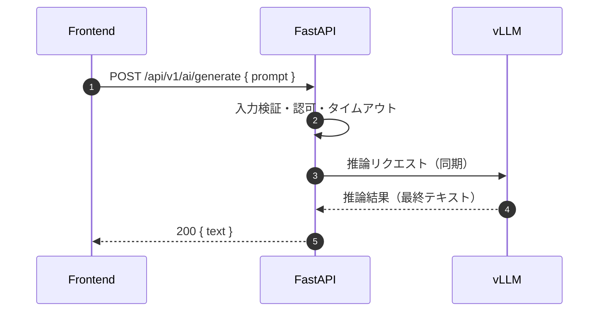
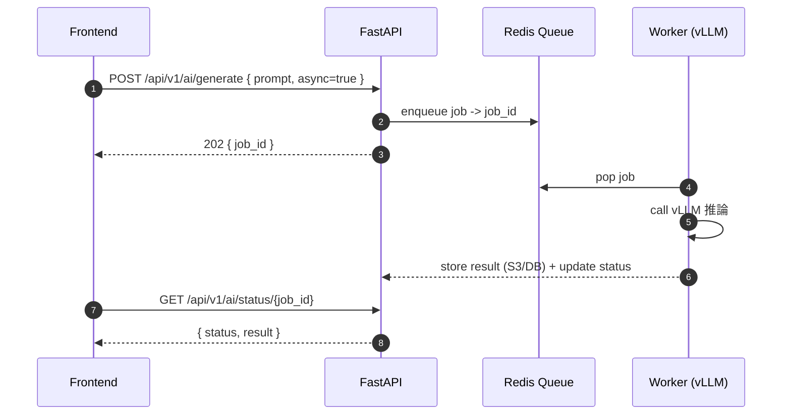

# アーキテクチャ設計（ハッカソン：モックアップ最小構成）

目的: 短期間で動くプロトタイプ（モックアップ）を最速で作るための簡潔なアーキテクチャ。

---

## 要点（最小構成）

- フロントエンド: 既存の UI をそのまま利用。ボタンで /api/v1/ai/generate を呼ぶだけで動作すること。
- バックエンド: FastAPI（単一プロセス・同期パスを優先）
- AI 推論: vLLM を同一 Docker Compose 内で単一インスタンスとして起動。GPU が無ければ CPU 実行のフォールバックで動作確認する。
- 永続化/キュー: 当面不要（同期リクエストのみ）。後で Redis を追加可能。
- デプロイ（モック）: Docker Compose（FastAPI + vLLM コンテナ）。

---

## コンポーネント詳細（モック）

1. フロントエンド
   - 既存 UI の一部（例: テキスト入力 + 送信ボタン）を使う。
   - 単純な POST リクエストでレスポンスを受け取り、表示する。ストリーミングは省略可。

2. バックエンド (FastAPI)
   - 単一エンドポイント: POST /api/v1/ai/generate
   - 入力検証（必須項目のみ）、簡易エラーハンドリング、タイムアウト（例: 60s）を実装。
   - vLLM 呼び出しは同一ネットワーク内の HTTP/gRPC（または直接 Python API）で同期実行。

3. vLLM インスタンス
   - 単一モデルをロードして常駐。モデル切替は行わない。
   - ストリーミングは省略し、最初は最終テキストを返す。

---

## データフロー（モック）

1. ユーザーがフロントからプロンプトを送信
2. FastAPI がリクエストを受け、入力検証
3. FastAPI -> vLLM（同期）で推論実行
4. vLLM の結果を FastAPI が受け取り、フロントに返却

---

## API 例（最小）

POST /api/v1/ai/generate
- request:
  - prompt: string (必須)
  - max_tokens: int (任意)
- response (200):
  - { "text": "...", "tokens": 123 }
- error:
  - 400 (validation), 500 (internal)

---

## シーケンス図

同期モード（モックの基本フロー）:

非同期モード（将来追加予定、参考）:

---

## ロードマップ（優先度低→高ではなく即時実行順）

1. FastAPI の雛形 + /api/v1/ai/generate 実装（数時間）
2. 単一 vLLM コンテナでの推論確認（数時間）
3. フロントから呼べることを確認（1–2 時間）
4. Docker Compose で起動スクリプトを作成（1 時間）
5. UX 微調整（レスポンス表示、エラーハンドリング、タイムアウト）（1 日以内）

合計: 1 日〜2 日で動くモックを完成可能

---

## チェックリスト（モック）

- [x] FastAPI プロジェクト雛形（/generate エンドポイント）
- [x] vLLM 単体での推論確認（ローカル / コンテナ）
- [x] FastAPI と vLLM の同期接続確認
- [x] フロントからの呼び出し確認（既存 UI）
- [x] Docker Compose ファイル（fastapi, vllm）
- [x] 起動スクリプト作成（start.sh, stop.sh）
- [x] CPU フォールバック対応
- [x] モックレスポンス機能（vLLM 未接続時）
- [x] 美しいフロントエンド UI
- [x] 開発用スクリプト（dev.sh）
- [x] 完全なドキュメント（README.md）

---
