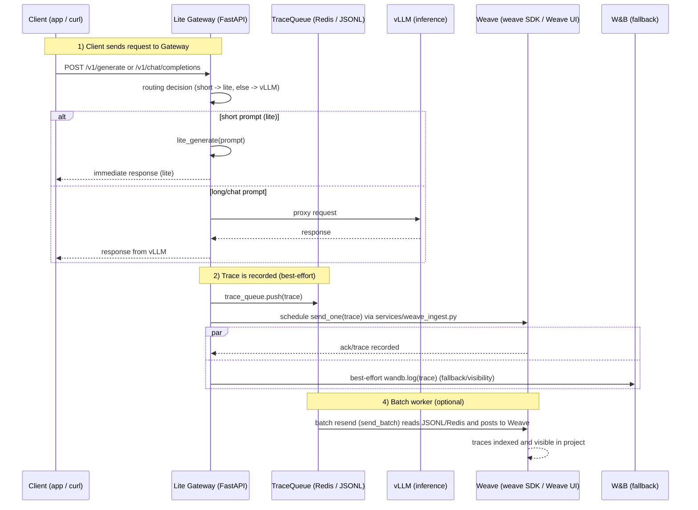

# GPT-OSS-20B: 学習・マージ・サービング手順書（開発者向け）

## 概要
このリポジトリは日本語文化に特化したモデルのLoRA学習、マージ、及びvllmでのサービング、Hugging Faceへのアップロード手順をまとめた開発者向けの手順書です。ローカルGPU環境（CUDA対応）での実行を想定しています。

## 前提条件
- Linux（Ubuntu 等）
- CUDA 対応GPU（GPUドライバ・CUDAツールキットが事前にインストール済み）
- Python 3.10+ 推奨
- 十分なディスク・メモリ（モデルサイズに依存）

## 依存パッケージのインストール
推奨: 仮想環境 (venv) を作成してから実行してください。

```bash
# OSパッケージ
apt-get update && sudo apt-get install -y build-essential git-lfs

# PyTorch - CUDAバージョンに合わせて適切な wheel を使ってください（例: cu128）
# pip install --upgrade --force-reinstall --index-url https://download.pytorch.org/whl/cu128 torch

# その他 Python パッケージ
pip install -r requirements.txt
```

注: 使用する CUDA バージョンに合わせて PyTorch のインストールコマンドを変更してください。

## 環境変数（シークレットはここに直接書かない）
以下のように環境変数で情報を渡すことを推奨します。シェルの起動スクリプト（例: `~/.bashrc`）または `.env` と direnv 等で管理してください。

```bash
export CC=/usr/bin/gcc
export PYTORCH_CUDA_ALLOC_CONF=expandable_segments:True
export HF_TOKEN="<YOUR_HUGGINGFACE_TOKEN>"
export HF_REPO_NAME="<YOUR_HF_REPO_NAME>"  # 例: username/repo-name
```

Hugging Face CLI を使う場合は安全にログインできます:

```bash
huggingface-cli login
# もしくは: export HF_TOKEN=... を設定した上で huggingface-cli whoami で確認
```

## Weights & Biases (wandb)
ログを使う場合は事前にログインしてください:

```bash
wandb login
```

## LoRA 学習（例）
このリポジトリの学習コードは Colab ノートブックを変換した `fine_tune_transfomers.py` に含まれています。ファイルはノートブック形式での実行を想定した構成（TRL / PEFT / Transformers を用いた設定とサンプル実行）になっており、以下のいずれかの方法で実行してください。

1. ノートブックとして実行（推奨）
   - Jupyter や Colab で `fine_tune_transfomers.py`（または元の .ipynb）を開き、ハイパーパラメータ（SFTConfig など）を確認・調整してからセルを順に実行します。

2. スクリプトとして実行（編集が必要）
   - `fine_tune_transfomers.py` はそのままでは対話的セル実行を前提に書かれているため、スクリプトで実行する場合は内部のハイパーパラメータやデータ読み込みパス（例: `dataset = load_dataset("json", data_files={"train": "train_dataset.jsonl"}, split="train")`）をプロジェクトに合わせて編集してから実行します。

実行例（スクリプトを編集した上で）:

```bash
python fine_tune_transfomers.py
```

説明: スクリプトは LoRA (PEFT) による微調整を行うサンプル実装です。TRL の `SFTConfig`、PEFT の `LoraConfig` 等を用いています。大規模モデルの学習は VRAM を大量に消費するため、十分な GPU（例: H100 80GB）を推奨します。リソースが限られる場合は `per_device_train_batch_size` や `max_length`、`gradient_accumulation_steps` を調整してください。

## モデルのマージ
学習済みの PEFT アダプタとベースモデルをマージするためのスクリプトは `gpt-oss-20b_merge_and_inf_bf16.py` です。現在の実装は以下の挙動です:

- ベースモデルを CPU 上で読み込み、PEFT アダプタを適用して `merge_and_unload()` を行います（GPU の OOM を避けるため）。
- マージ後のモデルを bfloat16（`torch.bfloat16`）に変換し、`save_pretrained`（safe_serialization=True, max_shard_size="10GB"）で出力します。
- マージ後のモデルディレクトリ（例: `gpt-oss-20b-merged`）を作成します。

実行方法:

- 現在のスクリプトはファイル内の変数（例: `peft_model_id` や `merged_dir`）を参照する形になっています。必要に応じて `peft_model_id` を学習で作成した PEFT モデルIDやローカルパスに書き換えるか、スクリプトを改修してコマンドライン引数を受け取るようにしてください。

例（スクリプトの変数を編集して実行）:

```bash
python gpt-oss-20b_merge_and_inf_bf16.py
```

説明: マージ結果は bfloat16（safetensors 形式）で保存され、`vllm` や推論用のロードに適した形式になります。出力先ディレクトリを確認の上、`vllm serve` 等でサービングしてください。

## vllm でのサービング（起動例）
以下は `vllm serve` でモデルを公開する例です。GPU メモリ設定や max length は環境に合わせて調整してください。

```bash
vllm serve ./gpt-oss-20b-merged \
  --host 0.0.0.0 \
  --port 8000 \
  --served-model-name gpt-oss-20b \
  --max-model-len 8192 \
  --gpu-memory-utilization 0.85
```

説明: 起動後、HTTP エンドポイントへリクエストを送って動作確認できます（詳細は vllm ドキュメント参照）。

## LiteLLM Gateway（前段プロキシ）

このリポジトリには既存の vLLM サーバの前段に配置する軽量ゲートウェイ `lite_gateway.py` が含まれています。既存クライアントに変更を加えずに導入でき、短いプロンプトはローカルで処理（LiteLLM）、長いプロンプトは vLLM にフォワードします。vLLM に到達できない場合はフェイルオーバーで Lite にフォールバックできます（設定可能）。

起動（簡易）:

```bash
# 既存の vLLM を起動（例: ポート8000）
vllm serve ./gpt-oss-20b-merged --host 0.0.0.0 --port 8000 --served-model-name gpt-oss-20b

# Lite Gateway を起動（デフォルト: 8001）
python lite_gateway.py
# または
uvicorn lite_gateway:app --host 0.0.0.0 --port 8001
```

環境変数（主なもの）:
- `VLLM_URL` - vLLM エンドポイント（default: `http://localhost:8000/v1/chat/completions`）
- `LITE_GATEWAY_PORT` - Lite Gateway の待ち受けポート（default: `8001`）
- `LITE_PROMPT_MAX_LEN` - Lite 処理の最大プロンプト長（文字数、default: `120`）
- `FILE_QUEUE_PATH` - Redis 未使用時の JSONL ログ出力先（default: `./llm_traces.jsonl`）
- `FALLBACK_ON_VLLM_DOWN` - vLLM ダウン時に Lite にフォールバックするか（default: `true`）

サンプル cURL (vLLM 直接):

```bash
curl -sS -X POST "http://localhost:8000/v1/chat/completions" \
  -H "Content-Type: application/json" \
  -d '{"model":"gpt-oss-20b","messages":[{"role":"user","content":"こんにちは、調子はどう？"}],"max_tokens":64}'
```

サンプル cURL (Lite Gateway 経由 — 互換エンドポイント):

```bash
curl -sS -X POST "http://localhost:8001/v1/chat/completions" \
  -H "Content-Type: application/json" \
  -d '{"model":"gpt-oss-20b","messages":[{"role":"user","content":"こんにちは、調子はどう？"}],"max_tokens":64}'
```

ヘルスチェック:

```bash
curl http://localhost:8001/health
# -> {"gateway":"ok","vllm":true}
```

ログ:
- Lite Gateway はトレースを Redis の `llm_traces` リストに送信するか、Redis が無い環境では `FILE_QUEUE_PATH` に JSONL を追記します。別途 logging worker を実行して JSONL/Redis から wandb/Weave に取り込んでください。

## Hugging Face へアップロード
Hugging Face のモデルリポジトリを作成し、モデルをアップロードする例:

```bash
# リポジトリ作成（必要に応じて）
huggingface-cli repo create ${HF_REPO_NAME} --type model

# API トークンを設定済みであれば、アップロードスクリプトを使う
python hf_upload.py --model-dir ./gpt-oss-20b-merged --repo-id ${HF_REPO_NAME} --token "$HF_TOKEN"
```

代替: `huggingface_hub` の API を直接使う方法や、`git lfs` を使ってモデルファイルを push する方法もあります。

## 動作確認の簡単なテスト
1. サーバ起動後、curl 等で簡単な推論リクエストを送る。
2. 学習・マージ後の出力ファイルが存在することを確認する。

例（ダミー）:

```bash
curl -X POST "http://localhost:8000/v1/generate" -H "Content-Type: application/json" -d '{"model":"gpt-oss-20b","input":"こんにちは"}'
```

※ 実際のエンドポイントは vllm のバージョンや設定により異なります。

## トラブルシューティング（よくある問題）
- CUDA メモリ不足: `--gpu-memory-utilization` を下げるか、バッチサイズ／max length を減らす。
- Hugging Face token が通らない: `huggingface-cli login` を行うか `HF_TOKEN` を再設定。
- pip での依存関係衝突: 新しい仮想環境で再インストールを試す。
- git-lfs がない: `sudo apt-get install git-lfs` を実行し `git lfs install` を実行。

## 推奨 LoRA 設定（OOM 回避）

大規模 MoE モデルでは `gate_up_proj` が非常に大きくなりやすく、全て有効にすると GPU メモリ不足（OOM）を引き起こします。まずは `down_proj` のみを対象にして学習を行い、必要に応じて限定的に `gate_up_proj` を追加することを推奨します。以下は本リポジトリで動作確認できている例です。

```python
from peft import LoraConfig

peft_config = LoraConfig(
    r=8,
    lora_alpha=16,
    target_modules=None,
    target_parameters=[
        # "7.mlp.experts.gate_up_proj",  # gate_up_proj は OOM になりやすいので初期はコメント
        "7.mlp.experts.down_proj",
        "15.mlp.experts.down_proj",
        "23.mlp.experts.down_proj",
    ],
)
```

対処ガイド:
- まずは `down_proj` のみで学習を行う（上記設定）。
- `gate_up_proj` を追加したい場合は 1 層だけ（例: `15.mlp.experts.gate_up_proj`）から試す。全層追加は避ける。
- メモリを減らすオプション: `r` を 8→4→2 に下げる、`lora_alpha` を低めにする、`per_device_train_batch_size` を下げる、`gradient_accumulation_steps` を増やす。
- インフラ面の対策: `bf16`（既定）、`gradient_checkpointing=True`、DeepSpeed/ZeRO またはオフロードを検討。

モジュールごとのサイズを確認して大きい箇所を特定する簡単なスニペット:

```python
# model は既にロード済みの想定
import torch
sizes = []
for n, p in model.named_parameters():
    if "gate_up_proj" in n or "down_proj" in n:
        sizes.append((n, p.numel(), p.shape))
sizes = sorted(sizes, key=lambda x: x[1], reverse=True)
for name, numel, shape in sizes:
    mb = numel * 2 / (1024**2)  # bf16=2 bytes 想定
    print(f"{name:60s} {shape} {numel:,} params ~{mb:.1f} MB")
```

これによりどの `gate_up_proj` が最も大きいかを把握でき、追加すべき層を決めやすくなります。

## 起動スクリプト: vLLM と Lite Gateway の起動順序

リポジトリには vLLM と Lite Gateway を順序よく起動 / 停止する簡易スクリプト `start_services.sh` を追加しました。以下の点が反映されています。

- デフォルトのポート
  - vLLM: 8000
  - Lite Gateway: 8001 (デフォルト)
- デフォルトモデルディレクトリ/リポジトリ
  - `MODEL_DIR` のデフォルトは `a1273352/gpt-oss-20b-japanese-culture` に設定されています。
  - ローカルのマージ済みモデルを使う場合は `MODEL_DIR` をローカルパス（例: `./gpt-oss-20b-merged` または絶対パス）に変更してください。
  - Hugging Face の非公開リポジトリを使う場合は `HF_TOKEN` を環境変数に設定してください。

スクリプトの場所: `./start_services.sh`

使い方:

```bash
# 実行権を付与
chmod +x ./start_services.sh

# 起動（vLLM を起動して準備完了後に Lite が起動します）
./start_services.sh start

# 停止
./start_services.sh stop

# 再起動
./start_services.sh restart

# 状態確認
./start_services.sh status
```

環境変数の例:

```bash
# デフォルト以外を使いたい場合
export MODEL_DIR="/path/to/gpt-oss-20b-merged"    # または HF の repo (例: a1273352/...) 
export VLLM_PORT=8000
export LITE_GATEWAY_PORT=8001
export HF_TOKEN="<YOUR_HF_TOKEN>"  # 非公開 HF リポジトリを使う場合
./start_services.sh start
```

動作確認 (起動後):

```bash
# Lite 側ヘルス
curl http://localhost:8001/health
# vLLM 直接
curl -sS -X POST "http://localhost:8000/v1/chat/completions" -H "Content-Type: application/json" -d '{"model":"gpt-oss-20b","messages":[{"role":"user","content":"こんにちは"}],"max_tokens":8}'
# Lite 経由
curl -sS -X POST "http://localhost:8001/v1/chat/completions" -H "Content-Type: application/json" -d '{"model":"gpt-oss-20b","messages":[{"role":"user","content":"こんにちは"}],"max_tokens":8}'
```

補足:
- スクリプトは簡易的な運用向けです。systemd / supervisor 等での運用やログローテーションは別途ご検討ください。
- Lite のローカル応答は現在メンテナンスモードの固定メッセージ（短いプロンプト向けのフォールバック）になっています。実運用では `lite_generate` を実際の小型モデルに差し替えてください。

## アーキテクチャ概要（シーケンス図）
以下は本リポジトリで実装した Lite Gateway と vLLM、トレース取り込みの流れを示すシーケンス図です。初めて見る人でも処理の順序と各コンポーネントの役割がわかるように、図と短い説明を併記しています。



短いフロー説明:
1. Client が Lite Gateway にリクエストを送る。
2. Gateway はプロンプト長や chat 形式に応じてローカルの Lite 応答（短文）か vLLM へプロキシ（長文 / chat）を選択する。
3. Gateway は全てのリクエストに対してトレースを作成し `TraceQueue`（Redis が利用可能なら Redis、未設定時は `llm_traces.jsonl`）に書き込む。
4. Gateway は non-blocking に Weave への送信（`services.weave_ingest.send_one` を asyncio.create_task で呼ぶ）をスケジュールし、同時に W&B へもベストエフォートでログを送る。直接送信が失敗した場合は JSONL に `.failed` ログを残す。
5. 別プロセスのバッチワーカーが `llm_traces.jsonl`（または Redis）を読み、小さなバッチで `send_batch` を呼んで Weave に再送・インデックス化する（再起動耐性のため cursor を保持）。

メリット（初心者向け）:
- Gateway を挟むことでクライアントの互換性を保ちながら短いプロンプトを高速に処理できる。
- ファイルフォールバックにより、ネットワークや Redis が無い環境でもトレースを失わない。
- Weave への直接送信と W&B フォールバックにより、審査員向けの可視化を確保できる。